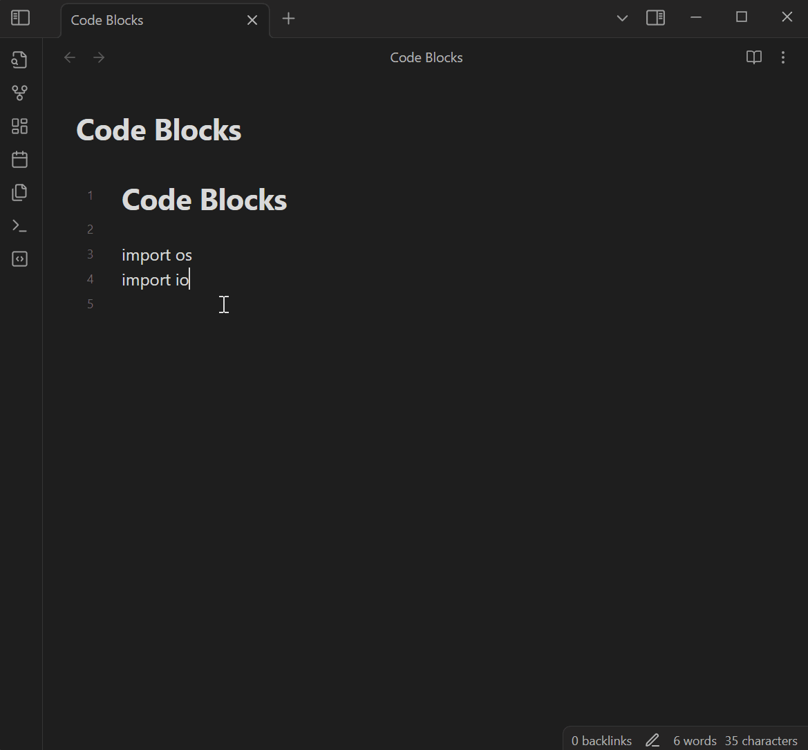
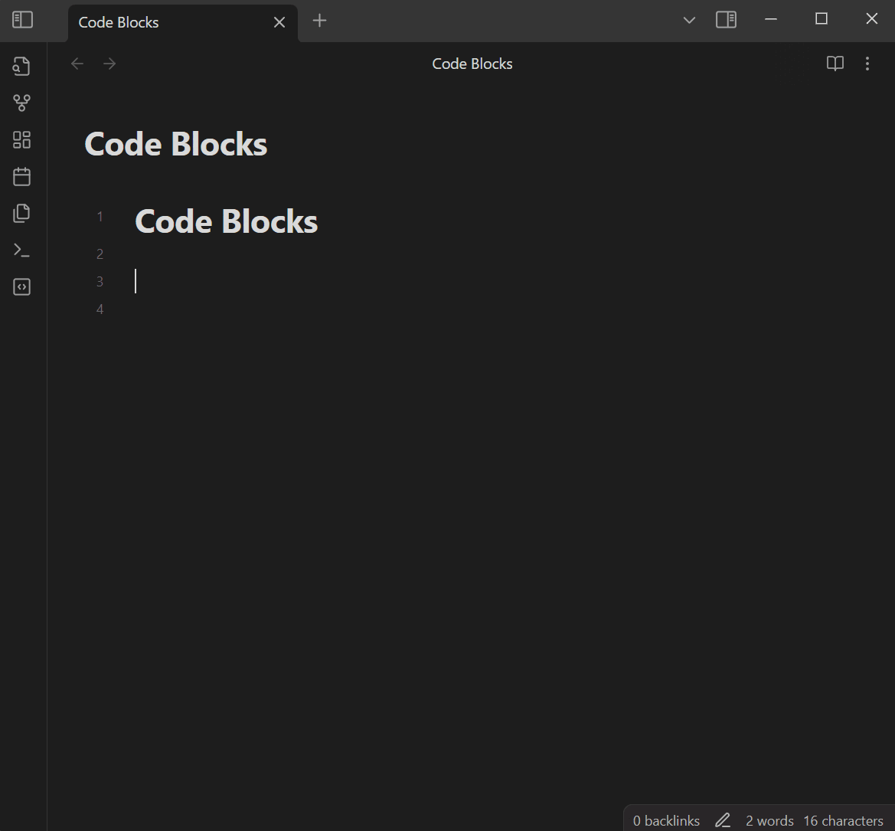

# Code Blocks commands

[English](./README.md) | [简体中文](./README-zh_CN.md) | **繁體中文**

## 介紹

這是一個用於 [Obsidian](https://obsidian.md) 的外掛，提供命令以插入帶有標記的程式碼塊，並支援使用反引號觸發命令。

## 功能

### 插入帶有標記的程式碼塊

您可以使用命令插入帶標記的程式碼塊：

### 使用反引號觸發命令

你可以透過使用反引號來觸發標記選擇選單：

### 其他特性

- 外掛會根據使用習慣對標記列表進行排序。
- 允許自定義語法高亮標記。

## 許可

[MIT](/LICENSE)
